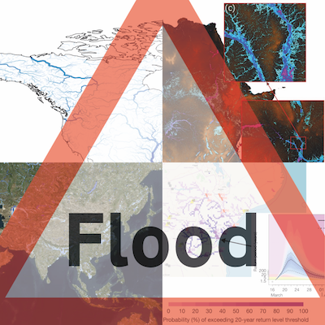

# How can we make flood data more useful?

This repository contains flood risk maps made with [folium](https://python-visualization.github.io/folium/), for use in the [Brigstow](http://www.bristol.ac.uk/brigstow/) -funded seed corn project["How can flood data be more useful?"](https://brigstowinstitute.blogs.bristol.ac.uk/project/how-can-flood-data-be-more-useful/).

These maps are part of a survey of Non-Government Organisations and government departments who use flood data in order to help physical scientists present it to them in the most useful way.

## How to use and change
For detailed instructions on how to use or change this code, read the [Contribution Guidelines](CONTRIBUTING.md), or contact us:

### Contact
GitHub Maintainer: [Natalie Thurlby](mailto:natalie.thurlby@bristol.ac.uk))
PI: [Laurence Hawker](mailto:laurence.hawker@bristol.ac.uk)